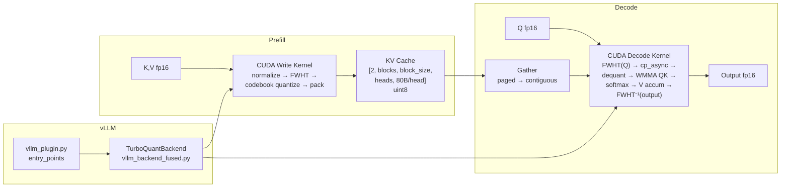

# Architecture

## Overview

TurboQuant compresses LLM KV cache from FP16 to 4-bit codebook quantization
(3.2× compression on A100, 3.76× theoretical) with near-zero quality loss.
It runs as a **vLLM plugin** — no vLLM source modification required (4 vendored
patches until upstream PR merges).



## Key Results (A100-40GB, Qwen3-8B)

| Metric | Value |
|--------|-------|
| KV compression | 3.2× (4-bit + fp16 norms, 80B/head vs 256B/head) |
| KV tokens (A100-40GB) | 266K (TQ) vs 83K (FP16) vs 166K (FP8 native) |
| TPOT @ seq=128 | 6.5 ms eager (vs FP16 3.9ms = 1.7×) |
| TPOT @ seq=4096 | 16.0 ms eager (vs FP16 4.1ms = 3.9×) |
| TPOT @ seq=32768 | 366 ms eager (vs FP16 20ms = 18×) |
| Kernel standalone @ 4096 | v5: 0.82 ms (vs FlashInfer 0.21 ms = 3.8×) |
| Kernel standalone @ 128 | v5: 0.04 ms (vs FlashInfer 0.34 ms = **TQ wins**) |
| Quality (PPL) | 14.91 → 14.91 (0.01% loss, WikiText-2) |
| Correctness | 100% exact token match (Qwen3-1.7B, 8B) |
| CUDA graph capture | ✅ (v4 path, graph-safe ops) |

## Tech Stack

| Layer | Choice | Files |
|-------|--------|-------|
| Decode kernel v5 | CUDA C++ + WMMA tensor cores | `csrc/include/flashinfer_decode_turboquant_v5_tc.cuh` |
| Decode kernel v4 | CUDA C++ scalar FMA (graph-safe) | `csrc/include/flashinfer_decode_turboquant_v4.cuh` |
| Write kernel | CUDA C++ (fused FWHT + quantize + scatter) | `csrc/include/turboquant/quantize_write_kernel.cuh` |
| Paged KV struct | CUDA C++ | `csrc/include/turboquant/page_turbo.cuh` |
| Algorithm | Python/PyTorch (codebook, Hadamard, quantizer) | `turboquant/*.py` |
| Serving | vLLM v0.19.0 plugin (entry_points) | `turboquant/vllm_plugin.py`, `vllm_backend_fused.py` |
| FlashInfer | Headers only (math, cp_async, state_t) | pip `flashinfer-python` |
| Docker | CUDA 12.6 + vLLM + patches | `Dockerfile`, `docker/vllm_patches/` |
| Deployment | Forge A100 cluster / ECR | `847366387031.dkr.ecr.ap-northeast-2.amazonaws.com/vllm-turboquant` |

## Directory Structure

```
turboquant/
├── turboquant/                    # Python package
│   ├── vllm_plugin.py             # vLLM entry_points registration
│   ├── vllm_backend_fused.py      # TurboQuantBackend + TurboQuantFusedImpl
│   ├── decode_kernel_v4.py        # JIT compile v4 decode binding
│   ├── write_kernel.py            # Python write kernel wrapper
│   ├── codebook.py                # Lloyd-Max codebook centroids + boundaries
│   ├── hadamard.py                # Hadamard rotation (Python reference)
│   ├── quantizer.py               # Core quantize/dequantize logic
│   ├── tile.py                    # Tile constants (TILE_DIMS=64, packing)
│   └── kernel_config.py           # Model presets (head_dim, GQA configs)
│
├── csrc/                          # CUDA kernels
│   ├── include/
│   │   ├── flashinfer_decode_turboquant_v5_tc.cuh  # v5 tensor-core decode (WMMA)
│   │   ├── flashinfer_decode_turboquant_v4.cuh      # v4 scalar-FMA paged decode
│   │   ├── flashinfer_decode_turboquant_v4_contiguous.cuh  # v4/v5 contiguous params
│   │   ├── flashinfer_decode_turboquant_v3.cuh      # cp_async helpers
│   │   ├── flashinfer_decode_turboquant_v2.cuh      # TurboQuantBatchDecodeParams
│   │   ├── flashinfer_decode_turboquant_combine.cuh  # Split-KV combine kernel
│   │   └── turboquant/
│   │       ├── page_turbo.cuh          # paged_kv_turbo_t (KV cache struct)
│   │       ├── quantize_write_kernel.cuh  # Write kernel (FWHT + quantize + scatter)
│   │       ├── flashinfer_dequant_load.cuh  # Dequant load helpers
│   │       └── hadamard.cuh            # Hadamard rotation device code
│   └── src/
│       ├── decode_v4_binding.cu        # v4 PyTorch bindings (torch.ops.turboquant.*)
│       ├── decode_v5_tc_binding.cu     # v5 bindings (decode_v5_from_cache + gather)
│       └── quantize_write_binding.cu   # Write bindings (torch.ops.turboquant_write.*)
│
├── docker/
│   └── vllm_patches/              # Vendored vLLM patches (until upstream PR merges)
│       ├── v1/attention/backend.py         # get_kv_cache_page_size() seam
│       ├── v1/kv_cache_interface.py        # custom_page_size field
│       ├── v1/worker/gpu_model_runner.py   # Sub-view reshape for smaller shapes
│       └── model_executor/layers/attention/attention.py
│
├── tests/                         # GPU tests + benchmarks
│   ├── test_decode_from_cache.py  # HYP-029 byte-equivalence test
│   ├── test_v5_tc.py              # HYP-031 v5 correctness + benchmark
│   ├── test_decode_kernel.py      # v4 kernel correctness
│   └── bench_*.py                 # Various benchmark scripts
│
├── docs/
│   ├── GOAL.md                    # Project goal + success criteria
│   ├── ROADMAP.md                 # Phase 1-14 roadmap
│   ├── SPEC.md                    # Behavioral spec
│   ├── ARCHITECTURE.md            # This file
│   ├── hypotheses/                # 31 experiment records (HYP-001 to HYP-031)
│   └── reference/                 # Supplementary analysis docs
│
├── Dockerfile                     # CUDA 12.6 + vLLM + patches + TurboQuant
├── pyproject.toml                 # Package config + vLLM entry_points
└── setup.py                       # data_files for csrc/ distribution
```

## Data Flow

### Prefill (write path)

```
Input: K, V [num_tokens, num_heads, head_dim] fp16
  ↓
quantize_write_kv_cache (CUDA kernel, dispatcher-routed):
  1. L2 normalize per head
  2. Signs × FWHT (Hadamard rotation, warp shuffles)
  3. Codebook quantize (Lloyd-Max 4-bit, 16 levels)
  4. Nibble pack (2 dims per byte)
  5. Scatter to kv_cache[slot] via slot_mapping
  ↓
Output: kv_cache [2, num_blocks, block_size, num_heads, 80B/head] uint8
  Layout per head: [32B quant | 4B norms (fp16) | 44B padding (16-byte aligned)]
```

### Decode (read path)

Two kernel paths, selected at runtime:

**v4 (graph-safe, used under CUDA graph capture):**
```
kv_cache → decode_v4_from_cache (torch.ops.turboquant.*):
  1. Derive k_base/v_base/norms from kv_cache.data_ptr() (dispatcher-refreshed)
  2. FWHT(signs × Q) in registers (fused into kernel)
  3. Per-tile loop: cp_async 4-bit → smem staging → inline dequant → scalar FMA QK
  4. Online softmax across tiles
  5. V dequant + scalar FMA accumulate
  6. FWHT(output) × signs (inverse rotation)
  → output [batch, num_qo_heads, head_dim] fp16
```

**v5 tensor-core (eager mode, 2.5× faster kernel):**
```
kv_cache → decode_v5_from_cache (pybind):
  1. gather_paged_to_contiguous (CUDA kernel): NHD paged → HND contiguous
  2. FWHT(signs × Q) in registers (32 threads × 4 elements)
  3. Per-tile loop:
     a. cp_async 4-bit → smem staging
     b. Cooperative dequant → fp16 smem buffer
     c. wmma::load_matrix_sync + wmma::mma_sync for QK (tensor cores)
     d. Scalar online softmax
     e. Dequant V + scalar accumulate
  4. Cross-warp merge (online softmax)
  5. FWHT(output) × scale × signs (inverse rotation, smem repack)
  → output [batch, num_qo_heads, head_dim] fp16
```

**Runtime selection:**
```python
if torch.cuda.is_current_stream_capturing():
    # Graph capture → v4 (zero allocations, dispatcher-routed)
else:
    # Eager → v5 (gather + WMMA, 2.5× faster kernel)
```

## Module Boundaries

**Dependency direction:** `vllm_backend_fused` → `decode_kernel_v4` / `v5_tc_binding` → `page_turbo.cuh` / `quantize_write_kernel.cuh`

```
vllm_plugin.py          ← vLLM entry_points (auto-loads on import)
    ↓
vllm_backend_fused.py   ← TurboQuantBackend (FlashAttentionBackend subclass)
    ↓                      TurboQuantFusedImpl (FlashAttentionImpl subclass)
    ├── torch.ops.turboquant.decode_v4_from_cache  (graph path)
    ├── v5_module.decode_v5_from_cache             (eager path)
    └── torch.ops.turboquant_write.quantize_write_kv_cache  (write path)
```

**Import rules:**
- `turboquant/*.py` never imports from `vllm` at module level (deferred to method bodies)
- CUDA kernels are JIT-compiled on first use via `torch.utils.cpp_extension.load`
- `csrc/` has no Python imports — pure C++/CUDA
- `docker/vllm_patches/` are standalone vLLM file overlays, not imports

## Quantization Format

Per token per head (hd=128, 2 dim_chunks of 64):

| Field | Bytes | Content |
|-------|-------|---------|
| Quantized data | 64 | 128 dims × 4 bits, nibble-packed |
| L2 norms | 4 | 2 × fp16 (one per 64-dim chunk) |
| Padding | 12 | Zero (16-byte alignment for cp_async) |
| **Total** | **80** | vs FP16: 256B (3.2× compression) |

Codebook: Lloyd-Max optimal for N(0,1), 16 levels (4-bit), stored in `__constant__` memory.

Hadamard rotation (FWHT) applied to both K/V at write time and Q/output at decode time
ensures the quantization error is uniformly distributed across dimensions (near-optimal
distortion rate, arXiv:2504.19874).

## CUDA Graph Support

Three bugs blocked graph replay (HYP-027/028/029, all fixed):

1. **Read path**: `cache_u8 = kv_cache.view(uint8)` baked placeholder ptr → fixed by
   `decode_v4_from_cache` taking `kv_cache` as a Tensor arg through the dispatcher.
2. **Write path**: Python scatter baked ptr → fixed by `quantize_write_kv_cache` op.
3. **Alignment**: `cp_async.ca` 128-bit loads need 16-byte aligned src → `bytes_per_head`
   padded to `align(qbytes+nbytes, 16)`.
4. **get_length**: strided indptr gave wrong seq_len → `paged_kv_turbo_t` takes `seq_lens` directly.

v5 graph-safety (HYP-033): `decode_v5_from_cache_ws` takes a pre-allocated workspace
(k_quant_ws, v_quant_ws, k_norms_ws, v_norms_ws, o_ws) and a static `max_len` int,
so the op does no allocations and no host sync. Registered under `torch.ops.turboquant_v5.*`.
The backend caches workspace by `(batch_size, max_pages)` keyed on vLLM's shape
buckets; the original `decode_v5_from_cache` stays in place for eager callers.

## Deployment

```
Dockerfile → tq-hyp029:v2 (Forge) → ECR (847366387031)
  - CUDA 12.6 + vLLM 0.19.0 + FlashInfer + TurboQuant
  - docker/vllm_patches/ applied at build time
  - TURBOQUANT_CSRC=/opt/turboquant/csrc for JIT

Launch:
  vllm serve Qwen/Qwen3-8B --dtype float16 \
    --attention-backend CUSTOM --kv-cache-dtype fp8 \
    --gpu-memory-utilization 0.85
```

## Upstream vLLM PR

Draft PR: https://github.com/vllm-project/vllm/pull/39868

Adds `custom_page_size` seam so plugin backends can declare per-block byte size.
Until merged, 4 files vendored in `docker/vllm_patches/`.

## Experiment History

32 hypotheses in `docs/hypotheses/` (HYP-001 to HYP-033):
- 12 confirmed, 14 rejected, 6 pending
- Kernel evolved: 856μs → 37μs (v4 graph) → 0.82ms v5 standalone @ seq=4096
- Key confirmed: HYP-008 (bdz=16), HYP-017 (contiguous), HYP-018 (split-KV),
  HYP-023 (CUDA graphs), HYP-029 (graph-safe ops), HYP-031 (tensor-core v5)
- In flight: HYP-033 (v5 graph-safe via pre-allocated workspace)
