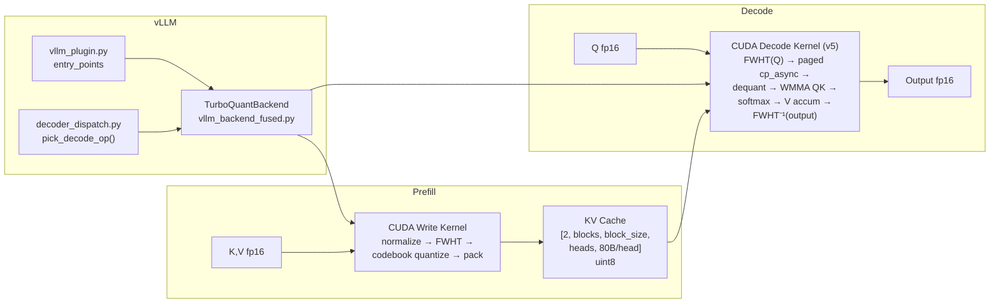

# Architecture

## Overview

TurboQuant compresses the LLM KV cache from fp16 to 4-bit codebook quantization
(3.2× on A100, 3.76× theoretical) with near-zero quality loss. It ships as a
**vLLM plugin** with a custom CUDA decode kernel. One small patch to vLLM
([PR #39868](https://github.com/vllm-project/vllm/pull/39868)) is still needed
for the `custom_page_size` seam; we ship it as a thin overlay under
`docker/vllm_patches/` until it merges.

Upstream vLLM has since merged its own Triton TurboQuant path
(`--kv-cache-dtype turboquant_4bit_nc`, merged 2026-04-15). Our kernel and
upstream's Triton kernel are benchmarked side-by-side in
[`BENCHMARKS.md`](BENCHMARKS.md). Short version:

- **Short ctx (≤2k):** upstream wins TPOT.
- **Mid ctx (4k–8k):** stock FA/FI win.
- **Long ctx (≥16k, batch≥4):** ours wins — up to **1.89× FA throughput** and
  **10× faster TTFT** at 32k × concurrency=8, driven by compression-preserved
  scheduler behaviour (no preemption).



## Tech Stack

| Layer | Choice | Files |
|-------|--------|-------|
| Decode kernel (SM80, prod) | CUDA C++ + WMMA, paged-native + split-KV + graph-safe | `csrc/include/flashinfer_decode_turboquant_v5_tc.cuh` |
| Decode kernel (fallback)   | CUDA C++ scalar FMA | `csrc/include/flashinfer_decode_turboquant_v4.cuh` |
| Write kernel               | CUDA C++ (fused FWHT + quantize + scatter) | `csrc/include/turboquant/quantize_write_kernel.cuh` |
| Paged KV struct            | CUDA C++ | `csrc/include/turboquant/page_turbo.cuh` |
| Runtime op selection       | Python (by `compute_capability`) | `turboquant/decoder_dispatch.py` |
| Algorithm ref              | Python / PyTorch (codebook, Hadamard, quantizer) | `turboquant/codebook.py`, `hadamard.py`, `quantizer.py` |
| vLLM integration           | Plugin via `entry_points` | `turboquant/vllm_plugin.py`, `vllm_backend_fused.py` |
| FlashInfer                 | Headers only (math, cp_async, state_t) | pip `flashinfer-python` |
| Container                  | CUDA 12.6 + vLLM 0.19.0 + patches | `Dockerfile`, `docker/vllm_patches/` |
| Deployment                 | Local Docker build (`install.sh` / `docker build`) | `install.sh`, `Dockerfile` |

## Directory Structure

```
turboquant/
├── turboquant/                        # Python package
│   ├── vllm_plugin.py                 # entry_points registration
│   ├── vllm_backend_fused.py          # TurboQuantBackend + TurboQuantFusedImpl
│   ├── decoder_dispatch.py            # pick_decode_op() by compute capability
│   ├── decode_kernel_v4.py            # JIT compile + v4 bindings
│   ├── write_kernel.py                # Python write-kernel wrapper
│   ├── codebook.py                    # Lloyd-Max centroids + boundaries
│   ├── hadamard.py                    # FWHT reference
│   ├── quantizer.py                   # Core quantize / dequantize
│   ├── tile.py                        # Tile constants
│   ├── kernel_config.py               # Per-model head-dim / GQA presets
│   └── triton_decode.py               # Triton reference (debugging only)
│
├── csrc/
│   ├── include/
│   │   ├── flashinfer_decode_turboquant_v5_tc.cuh   # v5 WMMA decode (prod)
│   │   ├── flashinfer_decode_turboquant_v4.cuh      # v4 scalar fallback
│   │   ├── flashinfer_decode_turboquant_combine.cuh # split-KV combine
│   │   └── turboquant/
│   │       ├── page_turbo.cuh                       # paged_kv_turbo_t
│   │       ├── quantize_write_kernel.cuh            # write kernel
│   │       └── hadamard.cuh                         # FWHT device code
│   └── src/
│       ├── decode_v4_binding.cu                     # torch.ops.turboquant.*
│       ├── decode_v5_tc_binding.cu                  # torch.ops.turboquant_v5.*
│       └── quantize_write_binding.cu                # torch.ops.turboquant_write.*
│
├── docker/
│   └── vllm_patches/                  # Thin overlay for PR #39868 seam
│       ├── v1/attention/backend.py
│       ├── v1/kv_cache_interface.py
│       ├── v1/worker/gpu_model_runner.py
│       └── model_executor/layers/attention/attention.py
│
├── tests/                             # GPU tests + benchmark harness
├── results/                           # Benchmark artefacts
│
├── docs/
│   ├── GOAL.md
│   ├── ROADMAP.md
│   ├── SPEC.md
│   ├── ARCHITECTURE.md                # this file
│   ├── BENCHMARKS.md                  # 4-way serving comparison
│   ├── hypotheses/                    # HYP-001 … HYP-047 experiment log
│   └── reference/
│
├── install.sh                         # Top-level local-build + run entry
├── Dockerfile
└── pyproject.toml
```

## Data Flow

### Prefill (write path)

```
Input: K, V [num_tokens, num_heads, head_dim] fp16
  ↓
quantize_write_kv_cache (CUDA kernel):
  1. L2 normalize per head
  2. Signs × FWHT (Hadamard rotation, warp shuffles)
  3. Codebook quantize (Lloyd-Max 4-bit, 16 levels)
  4. Nibble-pack (2 dims per byte)
  5. Scatter to kv_cache[slot] via slot_mapping
  ↓
Output: kv_cache [2, num_blocks, block_size, num_heads, 80B/head] uint8
  Layout per head: [64B quant | 4B norms (2×fp16) | 12B pad (16-byte aligned)]
```

### Decode (read path)

```
kv_cache → decode_v5_from_cache_paged_splitkv_ws (torch.ops.turboquant_v5.*):
  1. FWHT(signs × Q) in registers
  2. Per-tile loop (paged-native, walks page table):
     a. cp_async 4-bit → smem staging
     b. Warp-shuffle codebook LUT → fp16 smem buffer
     c. wmma::load_matrix_sync + wmma::mma_sync for QK (tensor cores)
     d. Scalar online softmax
     e. Dequant V + scalar accumulate
  3. Split-KV cross-warp merge (grid = batch × num_splits × kv_heads)
  4. FWHT(output) × scale × signs (inverse rotation)
  → output [batch, num_qo_heads, head_dim] fp16
```

The v5 path is **CUDA-graph-safe**: the op takes pre-allocated workspaces
(`k_quant_ws`, `v_quant_ws`, `k_norms_ws`, `v_norms_ws`, `o_ws`, partition
scratch) and a static `max_len`, so capture records zero allocations and no
host sync. The backend caches workspace keyed on vLLM's shape buckets.
Split-KV parameters (`request_indices`, `kv_tile_indices`, `split_indptr`,
`kv_chunk_size`) are filled in Python during warmup; a chunk-cap heuristic
(HYP-044) picks `num_splits` per bucket to avoid over-splitting at
`batch ≥ 8`.

### Runtime dispatch

`decoder_dispatch.pick_decode_op()` returns the best op for the current GPU
based on `torch.cuda.get_device_capability()`:

| Compute cap. | Op                                                       | Notes            |
|--------------|----------------------------------------------------------|------------------|
| SM80 (A100)  | `turboquant_v5.decode_v5_from_cache_paged_splitkv_ws`    | Production       |
| SM90 (H100)  | `turboquant_v6.decode_v6_wgmma_paged_splitkv_ws`         | Planned (15b)    |
| SM100 (B200) | `turboquant_v7.decode_v7_fp4_paged_splitkv_ws`           | Planned (15c)    |

Override with `TQ_FORCE_KERNEL=v4|v5|v6|v7` for A/B testing. `v4` remains as
a graph-safe scalar fallback.

## Module Boundaries

**Dependency direction:**
`vllm_plugin → vllm_backend_fused → decoder_dispatch → torch.ops.turboquant_v5.* → csrc/*.cu(h)`

**Import rules:**
- `turboquant/*.py` never imports `vllm` at module top-level (deferred to
  method bodies so the package is importable without vLLM installed).
- CUDA kernels are JIT-compiled on first use via
  `torch.utils.cpp_extension.load`; `csrc/` has no Python imports.
- `docker/vllm_patches/` are overlays, not Python modules.

## KV Cache Layout

### Tensor shape

vLLM allocates a single uint8 tensor per layer (see
`TurboQuantBackend.get_kv_cache_shape`):

```
kv_cache : [2, num_blocks, block_size, num_kv_heads, bytes_per_head]  uint8
           │  │           │           │              └─ 80 for hd=128
           │  │           │           └─ KV heads per TP rank
           │  │           └─ tokens per page (vLLM block_size, typ. 16)
           │  └─ total pages in the pool
           └─ 0 = K, 1 = V
```

`bytes_per_head` is computed per model:

```
dim_chunks     = next_pow2(head_dim) / 64
raw            = dim_chunks·32  (quant)  +  dim_chunks·2  (fp16 norms)
bytes_per_head = (raw + 15) & ~15             # 16-byte align for cp.async
```

For common head dims:

| head_dim | dim_chunks | quant | norms | pad | **bytes_per_head** | fp16 ref | ratio |
|---------:|-----------:|------:|------:|----:|-------------------:|---------:|------:|
| 64       | 1          | 32    | 2     | 14  | **48**             | 128      | 2.67× |
| 128      | 2          | 64    | 4     | 12  | **80**             | 256      | 3.20× |
| 256      | 4          | 128   | 8     |  8  | **144**            | 512      | 3.56× |

### Per-head byte map (hd=128, production case)

```
byte  0                                                          79
      ┌──────────────────┬──────────────────┬───────┬──────────────┐
      │  chunk-0 quant   │  chunk-1 quant   │ norms │   padding    │
      │  32 B (64 dims)  │  32 B (64 dims)  │  4 B  │    12 B      │
      │  nibble-packed   │  nibble-packed   │ 2×fp16│    zero      │
      └──────────────────┴──────────────────┴───────┴──────────────┘
       └──── qbytes = 64 ─────┘           └── nbytes=4 ─┘
                                                        └ 16-B align ┘
```

Each nibble indexes a 16-level Lloyd-Max codebook. One fp16 norm per 64-dim
chunk restores L2 magnitude at dequant time. Norms live **inline** with the
quant bytes in this single tensor; `paged_kv_turbo_t` is constructed with
`entry_byte_stride = 80` and a matching `norm_entry_byte_stride` so the
kernel walks one contiguous stride per token per head.

### Per-page indexing

```
slot(page, token, head) = kv_cache[kv_idx, page, token, head, :]      # 80 bytes
                          │
                          ├─ bytes[ 0 : 64]  → 4-bit codebook indices (K or V)
                          ├─ bytes[64 : 68]  → 2 fp16 L2 norms
                          └─ bytes[68 : 80]  → padding

kv_idx ∈ {0, 1}  # K vs V
page   = block_table[request][logical_block]
token  = slot_within_page  # 0 .. block_size-1
```

### Write / read seams

```
Prefill write  (torch.ops.turboquant_write.quantize_write_kv_cache):
    K_fp16 ─┐                     ┌→ kv_cache[0, page, tok, h, :]
    V_fp16 ─┤  FWHT → L2-norm →   ┤
            │  codebook quant →   ├→ kv_cache[1, page, tok, h, :]
    slot ───┘  nibble pack        │
                                  └ 80-B tile (quant | norms | pad)

Decode read   (torch.ops.turboquant_v5.decode_v5_from_cache_paged_splitkv_ws):
    kv_cache[k, page, tok, h, :] ─→ cp.async → smem staging
                                 ─→ warp-shuffle LUT dequant → fp16 smem
                                 ─→ wmma QK / softmax / V accumulate
```

## Quantization Format

Codebook: Lloyd-Max optimal for N(0,1), 16 levels (4-bit), kept in a
register-resident LUT broadcast via `__shfl_sync` (HYP-032) — faster than
per-nibble `__constant__` lookups, which serialize across warp lanes.

FWHT (Walsh–Hadamard) is applied to K/V at write time and to Q/output at
decode time so quantization error is spread uniformly across dims
(near-optimal rate-distortion, arXiv:2504.19874).

## Deployment

Local-build only (no registry dependency):

```bash
# One-shot build + run
./install.sh          # builds vllm-turboquant:local and runs Qwen/Qwen3-8B

# Or manually:
docker build -t vllm-turboquant .
docker run --gpus all -p 8000:8000 vllm-turboquant \
    --model Qwen/Qwen3-8B \
    --gpu-memory-utilization 0.85 --max-model-len 32896
```

Default entrypoint flags: `--attention-backend CUSTOM --kv-cache-dtype fp8
--enforce-eager` (A100 SM80 cannot `torch.compile` fp8e4nv).

## Upstream vLLM interaction

Two distinct upstreams matter:

1. **Our seam PR**
   ([#39868](https://github.com/vllm-project/vllm/pull/39868)) — adds
   `custom_page_size` so plugin backends can declare per-block byte size.
   Still open. Until it merges, `docker/vllm_patches/` overlays the 4 files
   at image-build time.

2. **Upstream's Triton TurboQuant path** (merged 2026-04-15,
   `--kv-cache-dtype turboquant_4bit_nc`) — separate implementation written
   in Triton. See [BENCHMARKS.md](BENCHMARKS.md) for the head-to-head.
   Short version: upstream wins at short context, ours wins at long
   context under memory pressure.

## Experiment History

47 hypotheses in `docs/hypotheses/` (HYP-001 … HYP-047). Kernel evolved from
**856 μs** (Phase-3 standalone) to today's paged-native WMMA split-KV
kernel. Key confirmed hypotheses driving the current design:

- **HYP-008** `bdz=16` (256 threads)
- **HYP-017** contiguous + **HYP-018** split-KV
- **HYP-023** CUDA-graph capture
- **HYP-029** graph-safe ops for read + write paths
- **HYP-031** WMMA (v5 tensor-core decode)
- **HYP-032** register-resident codebook (warp-shuffle LUT)
- **HYP-033/034/035** v5 graph-safe workspace → split-KV → paged-native
- **HYP-044** chunk-cap split-K heuristic
- **HYP-045** skip dead workspace alloc at `num_splits > 1` (fixes OOMs)
- **HYP-047** KV offload/reuse — restore < prefill at every medium config

HYP-040 is the binding architectural rejection on A100:
`nvcuda::wmma::load_matrix_sync` is synchronous and SM80 has no async
`ldmatrix`, so the load→mma stall can't be hidden. Closing the remaining
long-ctx TPOT gap requires Hopper (`wgmma`, TMA) — see ROADMAP Phase 15b.
