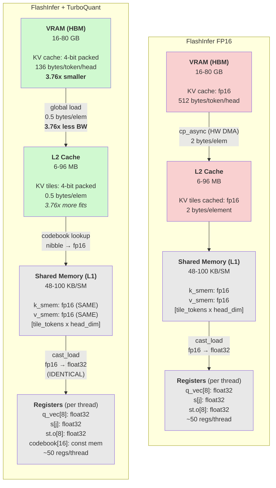
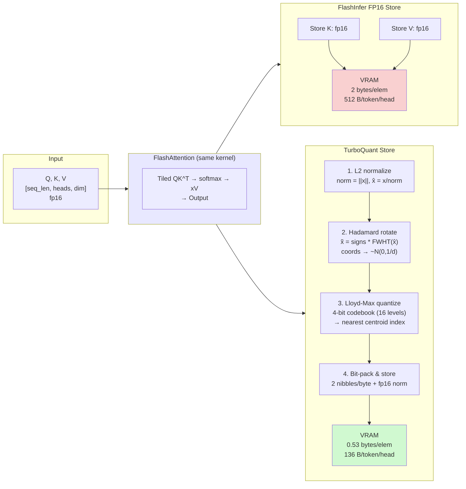
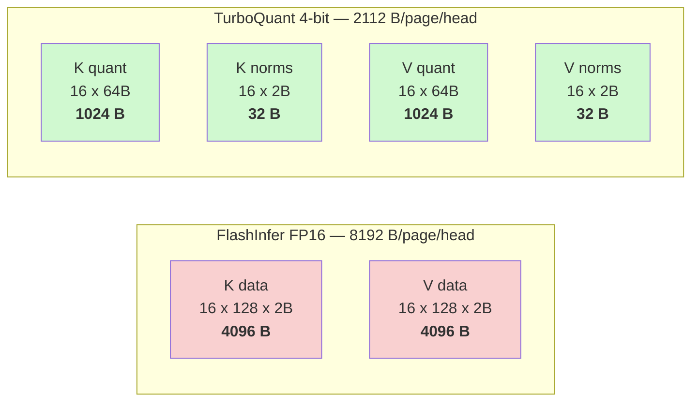
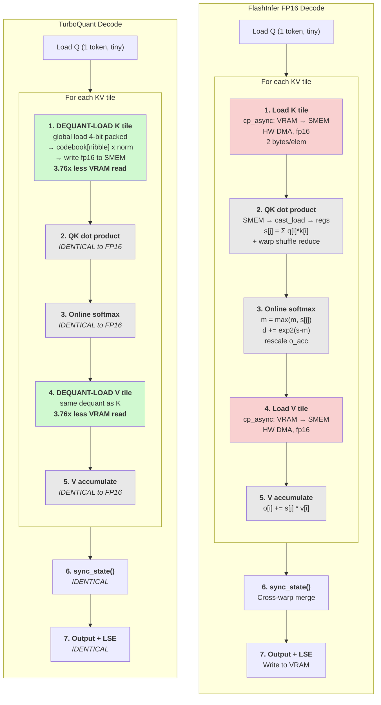
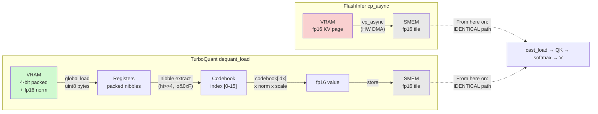
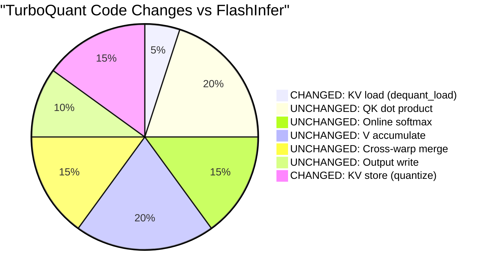

# FlashInfer vs TurboQuant Architecture Comparison

This document compares the data flow and memory hierarchy of FlashInfer (FP16 baseline)
and FlashInfer + TurboQuant (4-bit quantized KV cache) across prefill, decode, and the
GPU memory stack.

## GPU Memory Hierarchy

TurboQuant changes only the VRAM storage format and the VRAM-to-SMEM loading path.
Everything from shared memory onward is identical to FlashInfer FP16.



**Key difference:** VRAM stores 4-bit packed data (3.76x smaller). The dequant-load replaces
`cp_async` with a codebook lookup that writes fp16 into shared memory. From SMEM onward,
the compute path is byte-for-byte identical.

## Prefill Phase

During prefill, both systems compute attention identically. The difference is how
the KV cache is stored afterward.



### Prefill VRAM Layout Comparison

Per page (16 tokens, head_dim=128):



## Decode Phase

Decode reads ALL past KV tokens but produces only 1 output token per request.
This makes it **memory-bandwidth bound** — the bottleneck is reading KV from VRAM.
TurboQuant reads 3.76x less data.



### Decode: Dequant-Load Detail

This is the only changed code path. Every other function is FlashInfer's original.



## Bandwidth Analysis

Decode is memory-bound: it reads the entire KV cache but only computes 1 output token.
TurboQuant's 3.76x compression directly reduces the bandwidth bottleneck.

| Sequence Length | FP16 Read | TurboQuant Read | Savings |
|:-:|:-:|:-:|:-:|
| 1K | 6.0 MB | 1.6 MB | 3.76x |
| 4K | 24 MB | 6.4 MB | 3.76x |
| 16K | 96 MB | 25.5 MB | 3.76x |
| 64K | 384 MB | 102 MB | 3.76x |

The dequant compute cost is **fixed** (~15 us for codebook lookup).
The bandwidth savings **scale linearly** with sequence length.
At long sequences, TurboQuant's decode can be **faster** than FP16 because
bandwidth savings outweigh dequant overhead.

```
Theoretical decode latency @ 500 GB/s bandwidth:

  FP16 (seq=4K):     24 MB / 500 GB/s = 48 us
  TurboQuant (4K):   6.4 MB / 500 GB/s = 13 us + 15 us dequant = 28 us  (1.7x faster)

  FP16 (seq=64K):    384 MB / 500 GB/s = 768 us
  TurboQuant (64K):  102 MB / 500 GB/s = 204 us + 15 us dequant = 219 us (3.5x faster)
```

## Summary: What Changes, What Stays



| Component | FlashInfer FP16 | TurboQuant | Changed? |
|:--|:--|:--|:-:|
| **Prefill attention** | FlashAttention | FlashAttention | No |
| **KV store** | memcpy fp16 | normalize → Hadamard → quantize → pack | **Yes** |
| **KV load (decode)** | cp_async (HW DMA) | codebook dequant → fp16 SMEM | **Yes** |
| **QK dot product** | warp shuffle reduce | warp shuffle reduce | No |
| **Online softmax** | exp2 + running max | exp2 + running max | No |
| **V accumulate** | fused multiply-add | fused multiply-add | No |
| **Cross-warp merge** | sync_state() | sync_state() | No |
| **Output** | cast_store + LSE | cast_store + LSE | No |
| **SMEM format** | fp16 tiles | fp16 tiles | No |
| **Register format** | float32 | float32 | No |
| **VRAM format** | fp16 (2 B/elem) | 4-bit packed (0.53 B/elem) | **Yes** |
